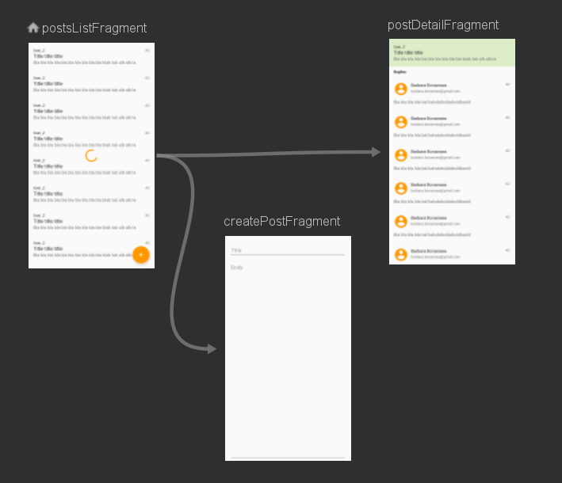

# Android Architecture

This project is built with kotlin. All data are collected from https://jsonplaceholder.typicode.com/.

I am implementing modern architecture for Android App. This application contains features to retrieve all posts data, view post detail & comments and send new post. I'm using [Kotlin Udacity]
and [rifqimfahmi]'s repository as reference.
I am using [git-karma] for commit message conventions.
There are still room for improvements, so I'm open for any feedback. Sharing with one another helps us all grow and learn. ✌️

### Api Service
```
@GET("posts")
fun getAllPostsAsync(): Deferred<List<NetworkPost>>

@POST("posts")
fun addPostAsync(@Body body: PostBody): Deferred<Response<NetworkPost>>

@GET("comments")
    fun getCommentsByPostIdAsync(@Query("postId") postId: String): Deferred<List<NetworkComment>>
```
### Navigation

The navigation between fragments is implemented using [Navigation Component]. Image below shows a visual representation of a navigation graph that contains two actions (both arrows) to different destinations (***postDetailFragment*** and ***createPostFragment***).



## Libs Dependencies
* [Retrofit] - HTTP client
* [Moshi] - JSON Parser
* [Room] - Database
* [Lifecycle] - ViewModel and LiveData
* [Coroutines] - Threading
* [Work Manager] - Background working
* [Navigation] - Navigation Component for navigate transactions
* [Timber] - Logging
* [Stetho] - Inspect DB

## Repository Created & Maintained By

### Fikri Razzaq

#Flutter Enthusiast, #Android Developer.

<a href="https://medium.com/@fikrirazzaq"></a>
<a href="https://twitter.com/fikrirazzaq"></a>
<a href="https://linkedin.com/in/fikrirazzaq"></a>

[Kotlin Udacity]: <https://classroom.udacity.com/courses/ud9012>
[rifqimfahmi]: <https://github.com/rifqimfahmi/android-mvvm-coroutine>
[Retrofit]: <https://square.github.io/retrofit/>
[Moshi]: <https://github.com/square/moshi>
[Room]: <https://developer.android.com/topic/libraries/architecture/room>
[Lifecycle]: <https://developer.android.com/topic/libraries/architecture>
[Coroutines]: <https://developer.android.com/topic/libraries/architecture/coroutines>
[Work Manager]: <https://developer.android.com/topic/libraries/architecture/workmanager>
[Navigation]: <https://developer.android.com/guide/navigation>
[Navigation Component]: <https://developer.android.com/guide/navigation>
[Timber]: <https://github.com/JakeWharton/timber>
[Stetho]: <https://github.com/facebook/stetho>
[git-karma]: <http://karma-runner.github.io/4.0/dev/git-commit-msg.html>

